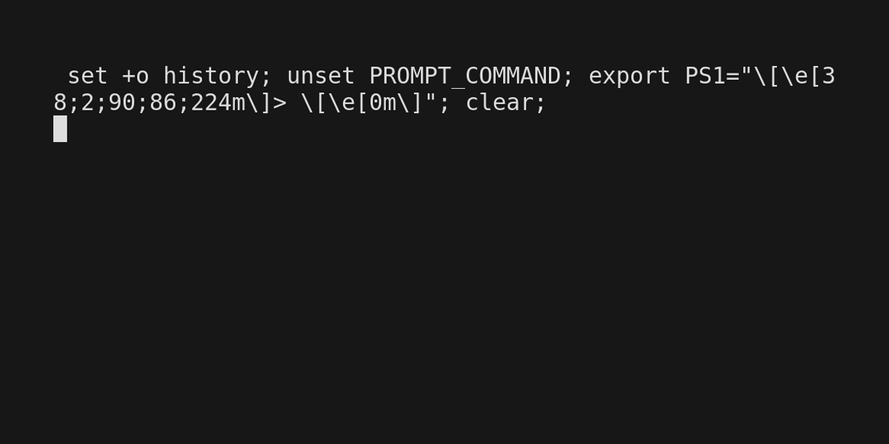

# xray2junit



This program converts the output of `xray scan --output simple-json` to
a junit report which can be used in gitlab-ci to display the results there.

## install

```bash
# Install to ~/.cargo/bin
cargo install --git https://github.com/dadav/xray2junit.git
```

## options

```bash
Options:
  -i, --input <FILE or STDIN(-)>    File to be processed [default: -]
  -o, --output <FILE or STDOUT(-)>  File to save the result [default: -]
  -d, --debug                       Turn debugging information on
  -h, --help                        Print help
  -V, --version                     Print version
```

## usage

```bash
jfrog scan --output simple-json . | xray2junit
```

Best used with gitlab-ci like this:

```yaml
---
xray-job:
  before_script: |
    cargo install --git https://github.com/dadav/xray2junit.git
    export PATH=$PATH:~/.cargo/bin
  script: xray scan --output simple-json | xray2junit -o report.xml
  artifacts:
    when: always
    paths:
      - report.xml
    reports:
      junit: report.xml
```
